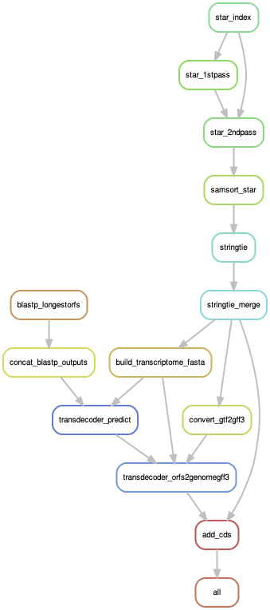

# AnnotationRNAseqAssembly
This repository consists of a Snakemake workflow to produce a CDS-annotated genome annotation using [Stringtie](https://github.com/gpertea/stringtie) and [TransDecoder](https://github.com/TransDecoder/TransDecoder). It consists of the following steps:

* Build a STAR aligner index for the genome if it doesn't already exist
* Perform 2-pass STAR alignment of provided paired-end RNA-seq reads to the genome
* Assembles transcripts from those alignments with Stringtie
* Predicts CDS and UTR features for the annotation with TransDecoder
* Adds back into the TransDecoder annotation those features for which open reading framers(ORFs) could not be found
  * TransDecoder normally discards things w/o detectable ORFs which we view as being less than ideal, so we fix that

Details of the workflow, and the order of operations are visualized in the directed acyclic graph (DAG) of the workflow, shown below.




To run the workflow, you need to create a directory called *data* directory within the workflow base directory that contains three subdirectories:

* **fastq**: contains the paired-end RNA-seq fastq files
* **genome**: contains the genome fasta, and a STAR index if already generated
* **blast**: this should be a protein blast database that predicted ORFs can be searched against. This is necessary to invoke a TransDecoder feature that, when selecting from a set of candidate ORFs, has TransDecoder prefer an ORF with a blastp hit over one that doesn't. 

You then need to:
* edit *sampletable.tsv* so it specifies your sample ids, and the full path names of the R1 and R2 fastq files for each sample. Note, if you wish to point to RNA-seq fastq files to a different location other than *data/fastq*, you need to do it in the sample sheet, in which case creating the *data/fastq* directory will not be necessary.
* edit *config/config.yaml*, especially if you are already supplying a STAR index--therefore need to indicate its location, and set *StarIndexExists* to TRUE, but you also need to supply the genome fasta file name (assuming it resides in  *data/genome*), and the prefix of the files in the protein blast database.
* if you are running the workflow on an HPC cluster, you will need to specify slurm partition names in *profiles/slurm/config.yaml*.

You can then execute the Snakemake worflow as follows:

```bash
snakemake --snakefile workflow/Snakefile --profile ./profiles/slurm
```

This command can easily be wrapped as a cluster submission job. As it simply manages conda package installs, submission of cluster data analysis jobs, and runs some low-memory serial jobs for file conversions, it can be submitted with one core, and with a modest amount of memory, e.g. a few Gb.

## Testing 
A small test data set using four RNA-seq paired-end libraries and one chromosome for *Drosophila melanogaster* are located in the **test** directory. The *config.yaml* file in the **config** directory as well as *samplesheet.tsv* currently point to data found in **test/**. This data set should take less than 10 minutes to execute assuming your wait times for SLURM jobs to run isn't long. To run this workflow on your own data, as alluded to above, you should create a **data** directory and make sure your config file and the sample sheet point to the correct location of your data. 

